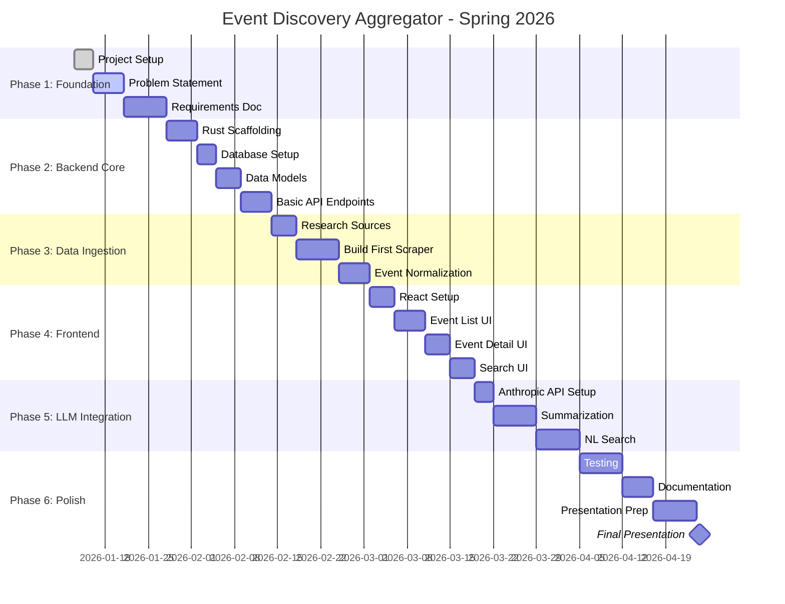

# Project Timeline

## Gantt Chart

## Milestone Summary

| Milestone | Target Date | Capstone Task |
|-----------|-------------|---------------|
| Problem Statement Complete | Jan 23, 2026 | Task 1 |
| System Requirements Spec | Feb 7, 2026 | Task 2 |
| Architecture Design | Mar 1, 2026 | Task 3 |
| Midcourse Presentation | Mar 15, 2026 | Task 4 |
| Final Presentation | Apr 24, 2026 | Final |

## Sprint Schedule

| Sprint | Dates | Focus |
|--------|-------|-------|
| Sprint 1 | Jan 13 - Jan 26 | Foundation, documentation |
| Sprint 2 | Jan 27 - Feb 9 | Backend scaffolding |
| Sprint 3 | Feb 10 - Feb 23 | Data models, API endpoints |
| Sprint 4 | Feb 24 - Mar 9 | Scraper, ingestion pipeline |
| Sprint 5 | Mar 10 - Mar 23 | Frontend MVP |
| Sprint 6 | Mar 24 - Apr 6 | LLM integration |
| Sprint 7 | Apr 7 - Apr 20 | Polish, testing |
| Sprint 8 | Apr 21 - Apr 26 | Presentation prep |
